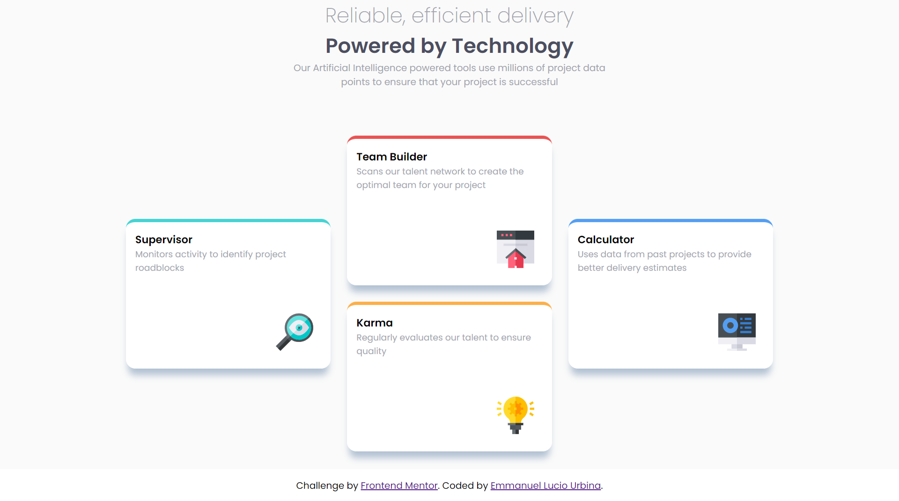

# Frontend Mentor - Four card feature section solution

This is a solution to the [Four card feature section challenge on Frontend Mentor](https://www.frontendmentor.io/challenges/four-card-feature-section-weK1eFYK). Frontend Mentor challenges help you improve your coding skills by building realistic projects.

## Table of contents

- [Overview](#overview)
  - [The challenge](#the-challenge)
  - [Screenshot](#screenshot)
  - [Links](#links)
- [My process](#my-process)
  - [Built with](#built-with)
  - [Continued development](#continued-development)
  - [Useful resources](#useful-resources)
- [Author](#author)

**Note: Delete this note and update the table of contents based on what sections you keep.**

## Overview

### The challenge

Users should be able to:

- View the optimal layout for the site depending on their device's screen size

### Screenshot

### Links

- Solution URL: [Github Repo.](https://github.com/emmanuelurbina/four-card-frontend-mentor)
- Live Site URL: [Live](http://emmanuelurbina.xyz/four-card-frontend-mentor/)

## My process

### Built with

- Semantic HTML5 markup
- CSS custom properties
- Flexbox

### Useful resources

- [nth child](https://developer.mozilla.org/es/docs/Web/CSS/:nth-child) - This helped me for gave style to each card without create an individual class for it's border color.

## Author

- Website - [Emmanuel](http://www.emmanuelurbina.xyz)
- Frontend Mentor - [@emmanuelurbina](https://www.frontendmentor.io/profile/emmanuelurbina)
- Twitter - [@emmanuelluur](https://www.twitter.com/emmanuelluur)

